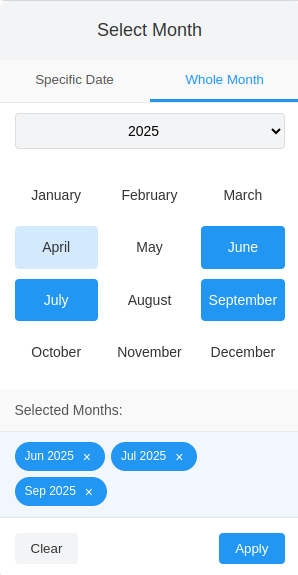
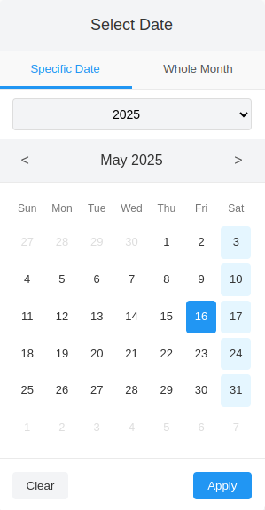

# DatepickerTabs

A versatile date picker with day and month selection modes, multiple selection support, and various formatting options.
<p>Great for booking systems! If users don't have a specific date in mind, they can easily pick a few different dates, a whole month, or even several months at once (with a maximum limit)</p>



## Features

- Day and Month selection modes
- Single or multiple selection
- Format customization
- Min/Max date constraints
- Max month selection limit
- Display type options: 'tabs', 'day', or 'month'
- Saturday-only selection for specific use cases
- Cookie-based mode persistence
- Tooltip overlay positioning
- Mobile-friendly design
- Automatic container creation
- Support for multiple instances with class selectors

## Installation

Clone or download the packege from GitHub.
Include css and js from dist folder to your page:

```html
<link rel="stylesheet" href="dist/css/custom-datepicker.min.css">
<script src="dist/js/custom-datepicker.min.js"></script>
```

## Basic Usage

```javascript
// Initialize on a single input with ID
const picker = new DatepickerTabs('#date-input');

// Initialize on multiple inputs with class
const pickers = new DatepickerTabs('.date-input-class');
```

## Options

You can customize the date picker by passing an options object:

```javascript
const picker = new DatepickerTabs('#date-input', {
    // Basic configuration
    mode: 'month',                   // 'day' or 'month' mode
    displayType: 'tabs',             // Display as 'tabs', 'day', or 'month'

    // Selection options
    multipleDays: false,             // Allow multiple day selection
    multipleMonths: true,            // Allow multiple month selection
    maxMonthSelection: 6,            // Max selectable months (when multipleMonths=true)

    // Date range options
    startDate: null,           // Initial selected date
    minDate: null,                   // Minimum selectable date
    maxDate: new Date(2026, 11, 31), // Maximum selectable date
    futureSaturdaysOnly: true,       // Only enable future Saturdays in day mode

    // Localization
    monthNames: ['January', 'February'],    // Custom month names
    dayNames: ['Sun', 'Mon'],          // Custom day names
    dateFormat: 'DD/MM/YYYY',        // Date display format
    monthFormat: 'MMM YYYY',         // Month display format

    // UI settings
    position: 'bottom',              // 'bottom' or 'top' position
    zIndex: 9999,                    // Picker z-index

    // Persistence
    cookieName: 'datepickerTabsMode',// Cookie name for mode storage

    backwardsYearsOffset: 5, // How many year offset render backwards in years selectbox. If now 2025 it will render from 2020
    forwardsYearsOffset: 5, // How many year offset render forwards in years selectbox. If now 2025 it will render till 2030

    // Callbacks
    onDateChange: function(date) {   // Date selection callback
        console.log('Selected date:', date);
    },
    containerId: '', //Custom container ID to render calendar (if not provided, one will be generated) 
});
```

### Available Options

| Option | Type     | Default              | Description                                                                     |
|--------|----------|----------------------|---------------------------------------------------------------------------------|
| `mode` | string   | 'day'                | Mode of operation: 'day' or 'month'                                             |
| `displayType` | string   | 'tabs'               | Display type: 'tabs', 'day', or 'month'                                         |
| `multipleDays` | boolean  | false                | Allow multiple date selection                                                   |
| `multipleMonths` | boolean  | false                | Allow multiple month selection                                                  |
| `maxMonthSelection` | number   | null                 | Maximum number of months that can be selected (when multipleMonths is true)     |
| `startDate` | Date     | null                 | Initial selected date                                                           |
| `minDate` | Date     | null                 | Minimum selectable date                                                         |
| `maxDate` | Date     | null                 | Maximum selectable date                                                         |
| `futureSaturdaysOnly` | boolean  | false                | Option for day mode to only enable Saturdays in the future                      |
| `monthNames` | array    | ['January', ...]     | Array of month names                                                            |
| `dayNames` | array    | ['Sun', ...]         | Array of day names                                                              |
| `cookieName` | string   | 'datepickerTabsMode' | Cookie name for mode persistence                                                |
| `backwardsYearsOffset` | number   | 5                    |  How many year offset render backwards in years selectbox. If now 2025 it will render from 2020                                             |
| `forwardsYearsOffset` | number   | 5                    |  How many year offset render forwards in years selectbox. If now 2025 it will render till 2030                                             |
| `dateFormat` | string   | 'DD MMM YYYY'        | Format for displaying dates                                                     |
| `monthFormat` | string   | 'MMM YYYY'           | Format for displaying months                                                    |
| `position` | string   | 'bottom'             | Position of the picker: 'bottom' or 'top'                                       |
| `zIndex` | number   | 9999                 | z-index for the picker container                                                |
| `onDateChange` | function | null                 | Callback function when date(s) change                                           |
| `containerId` | string   | ''                   | Custom container ID to render calendar (if not provided, one will be generated) |

## Date Formatting

The date picker supports the following tokens for date formatting:

- `DD`: Day of month with leading zero (01-31)
- `D`: Day of month without leading zero (1-31)
- `MMM`: Month name short (Jan, Feb, etc.)
- `MMMM`: Month name full (January, February, etc.)
- `MM`: Month number with leading zero (01-12)
- `M`: Month number without leading zero (1-12)
- `YYYY`: Full year (2023)
- `YY`: Short year (23)

```
DD MMM YYYY = 01 Jan 2025
DD/MM/YYYY  = 01/01/2025
MM/DD/YYYY  = 01/01/2025
YYYY-MM-DD  = 2025-01-01
```


## Methods

### setDate(date)

Sets the selected date(s).

```javascript
// Set a single date
picker.setDate(new Date());

// Set multiple dates
picker.setMultipleDays(true);
picker.setDate([new Date(2023, 0, 1), new Date(2023, 1, 1)]);

// Clear selection
picker.setDate(null);
```

### getDate()

Gets the currently selected date(s).

```javascript
const selectedDate = picker.getDate();
```

### setMode(mode)

Sets the picker mode ('day' or 'month'). Basically which tab to show active.

```javascript
picker.setMode('month');
```


### getMode()

Get the current tab mode show (which tab is active). 

```javascript
picker.getMode();
```

### setDisplayType(type)

Sets the display type ('tabs', 'day', or 'month'). When day or month - no tabs are shown. Only one of the two tabs mode.

```javascript
picker.setDisplayType('day');
```

### setMultipleDays(enable)

Enables or disables multiple days selection.

```javascript
picker.setMultipleDays(true);
```

### setMultipleMonths(enable)

Enables or disables multiple months selection.

```javascript
picker.setMultipleMonths(true);
```

### setDateFormat(format)

Sets the date format for day mode.

```javascript
picker.setDateFormat('YYYY-MM-DD');
```

### setMonthFormat(format)

Sets the date format for month mode.

```javascript
picker.setMonthFormat('MM/YYYY');
```

### setMinDate(date)

Sets the minimum selectable date.

```javascript
picker.setMinDate(new Date(2023, 0, 1));
```

### setMaxDate(date)

Sets the maximum selectable date.

```javascript
picker.setMaxDate(new Date(2024, 11, 31));
```

### setMaxMonthSelection(limit)

Sets the maximum number of months that can be selected when multiple selection is enabled.

```javascript
picker.setMaxMonthSelection(3);
```


### show()

Shows the date picker.

```javascript
picker.show();
```

### hide()

Hides the date picker.

```javascript
picker.hide();
```

### destroy()

Destroys the date picker instance and cleans up resources.

```javascript
picker.destroy();
```

## Events

The date picker fires the following custom events:

- `datepickerShow`: Fired when the date picker is shown
- `datepickerHide`: Fired when the date picker is hidden
- `datepickerModeChange`: Fired when the mode is changed
- `datepickerApply`: Fired when dates are applied
- `datepickerClear`: Fired when dates are cleared

You can listen for these events on the element where the date picker is initialized:

```javascript
document.getElementById('date-input').addEventListener('datepickerApply', function(e) {
  console.log('Applied date(s):', e.detail);
});
```

## Examples

### Basic Date Picker

```javascript
const datePicker = new DatepickerTabs('#date-input');
```

### Month Picker with Multiple Selection and maximum 3 months, with tabs to date select as well.

```javascript
const monthPicker = new DatepickerTabs('#month-input', {
  mode: 'month', 
  multipleMonths: true,
  maxMonthSelection: 3
});
```

### Date Picker with Constraints

```javascript
const constrainedPicker = new DatepickerTabs('#date-input', {
  minDate: new Date(2023, 0, 1),
  maxDate: new Date(2023, 11, 31),
  dateFormat: 'YYYY-MM-DD'
});
```

### Pick just one month

```javascript
const monthOnlyPicker = new DatepickerTabs('#month-only-picker', {
    mode: 'month',
    displayType: 'month',
    multipleMonths: false,
    monthFormat: 'MMM YYYY',
});
```

### Saturday-Only Picker for Events

```javascript
const saturdayPicker = new DatepickerTabs('#event-date', {
  futureSaturdaysOnly: true,
  dateFormat: 'DD/MM/YYYY'
});
```

### On change event to do something with dates

```javascript
const buttomDatePicker = new DatepickerTabs('#bottom-date-input', {
    mode: 'both',
    onDateChange: function(date) {
        console.log('Selected date:', date);
    }
});
```

## Browser Support

The date picker works in all modern browsers (Chrome, Firefox, Safari, Edge).

## How to Rebuild Styles

The project uses SCSS for styling and Gulp to compile it to CSS. Here's how to rebuild the styles when you make changes:

### Initial Setup

1. Make sure all dependencies are installed:
```bash
  npm install --save-dev gulp gulp-sass sass gulp-postcss autoprefixer cssnano gulp-sourcemaps gulp-rename
```

2. Ensure your SCSS files are in the correct location:

```angular2html
src/assets/scss/custom-datepicker.scss
```


### Rebuilding Styles

#### One-time Build

To compile your SCSS files to CSS once:

```bash
  npx gulp build
```

This will:
- Compile your SCSS to CSS
- Add vendor prefixes with Autoprefixer
- Create a minified version (custom-datepicker.min.css)
- Generate sourcemaps for debugging

The compiled CSS files will be in `src/assets/css/`.

#### Development Mode (Watch)

To automatically rebuild styles whenever you make changes to your SCSS files:

```bash
  npx gulp
```

Here's the text starting from "This starts the watch task that will:":
This starts the watch task that will:
- Monitor your SCSS files for changes
- Automatically recompile when changes are detected
- Generate both regular and minified CSS files

#### Troubleshooting

If you encounter build errors:

1. Check for SCSS syntax errors in your files
2. Ensure all required dependencies are installed
3. Verify the paths in gulpfile.js match your project structure

Common errors:
- `'compileStyles' errored after X ms`: Look for syntax errors in your SCSS
- `Cannot find module 'X'`: You need to install the missing dependency

## Best practices

Please note that all styles are inside the .custom-datepickertabs-container selector
So best practice to override some style is to make selector inside the .custom-datepickertabs-container.
For example you want to hide the clear and apply buttons, because you are using the single selection mode:

```css
.custom-datepickertabs-container .datepicker-footer {
    visibility: hidden;
    display: none;
}
```